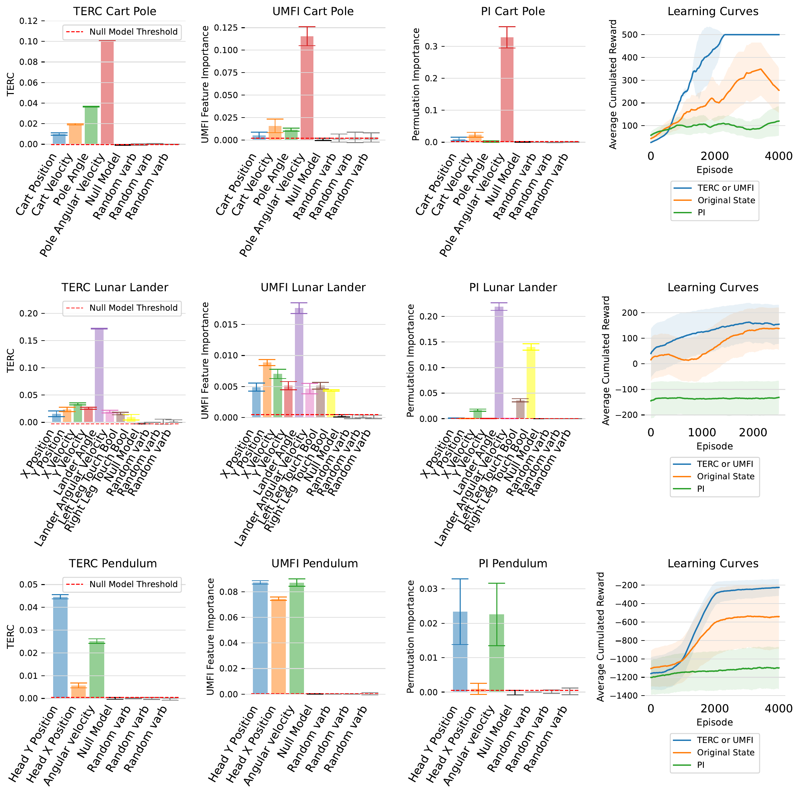

# TERC
# A Transfer Entropy Redundancy Criterion for State Variable Selection in Reinforcement Learning

This repository contains the code used to generate the results presented in the paper:

> **TERC: A Transfer Entropy Redundancy Criterion for State Variable Selection in Reinforcement Learning**
> *[Charles Westphal](https://c-s-westphal.github.io/), et al.*
> Transactions on Machine Learning Research (TMLR), under review.

## Table of Contents

- [Introduction](#introduction)
- [Installation](#installation)
- [Usage](#usage)
- [Environments](#environments)
- [Repository Structure](#repository-structure)
- [Citation](#citation)

## Introduction

In this repo, we publish the code used to create the results in *A Transfer Entropy Redundancy Criterion for State Variable Selection in Reinforcement Learning* (TERC). TERC is an information-theoretic criterion that selects the **smallest subset of observable state variables** an agent's actions actually depend on. For each variable $X_i$ it estimates the transfer-entropy based quantity

$$\Phi_{X_i;\,\mathcal{X}\rightarrow A} = H(A\mid\mathcal{X}_{\setminus X_i}) - H(A\mid\mathcal{X}) \ge 0,$$

i.e. the reduction in the uncertainty of the actions $A$ attributable to $X_i$. Variables whose contribution is statistically indistinguishable from a known-uninformative null model are removed one at a time (Algorithm 1), so that — unlike pairwise feature-selection methods — TERC correctly resolves the **redundant** and **synergistic** relationships that arise between state variables. The conditional entropies are estimated via mutual information using a MINE-style neural estimator.

Applying TERC across synthetic data and reinforcement-learning environments of increasing complexity yields the following main results:



The bars show the final $\Phi_{X_i;\,\mathcal{X}\rightarrow A}$, UMFI, and PI scores for Cart Pole, Lunar Lander, and Pendulum, whose states have been "doped" with extra random variables. TERC (and UMFI) correctly assign near-zero importance to the random variables — placing them within the null-model threshold (red dashed line) so they are removed — while PI fails to recover the full set of informative variables. Retraining on the reduced TERC state improves learning efficiency (right-hand panel).

## Installation

1. **Clone the Repository:**

   ```bash
   git clone https://github.com/c-s-westphal/terc-rl.git
   cd terc-rl
   ```

2. **Create a Virtual Environment:**

   ```bash
   python3 -m venv .venv
   source .venv/bin/activate
   ```

3. **Install Required Packages:**

   ```bash
   pip install -r requirements.txt   # or: pip install -e .
   ```

   The `LunarLander` environment additionally requires Box2D (needs SWIG and a
   C/C++ toolchain): `pip install gymnasium[box2d]`. All other environments work
   without it.

## Usage

Run the full TERC pipeline (train an agent -> select state variables -> retrain and
record learning curves) using:

```bash
python main.py --name ENV_NAME --stage STAGE
```

For example:

```bash
# Full pipeline on Cart Pole
python main.py --name CartPole --stage all

# Synthetic redundancy datasets (variable selection only)
python main.py --name 4red_varbs --stage all
python main.py --name 2red_trips --stage all

# TERC selection only, per-training-quartile interpretability analysis
python main.py --name CartPole --stage terc --quartiles
```

### Arguments

- `--name`: Environment / dataset to use. Choices are `4red_varbs`, `2red_trips`,
  `SKG`, `TFMT`, `CartPole`, `LunarLander`, `Pendulum`.
- `--stage`: Pipeline stage(s) to run. Choices are `trajectories`, `terc`,
  `curves`, `all` (default: `all`).
- `--num-trajectories`: Number of trajectories rolled out during generation
  (default: `10000`).
- `--num-iters`: Number of MINE training iterations for TERC (default: `10`).
- `--batch-size`: MINE mini-batch size (default: `100`).
- `--lr`, `--lra`, `--lrc`: Learning rates for MINE, the actor, and the critic.
- `--n-experiments`: Repeated MINE runs averaged per variable (default: `5`).
- `--quartiles`: Run the per-training-quartile TERC analysis instead of the
  standard full-trajectory selection.
- `--data-dir`, `--results-dir`: Output directories (default: `outputs`).

Outputs (trajectories, per-variable MI curves, and learning curves) are written
to the `outputs/` directory as `.npy` files; plotting helpers are provided in
`terc/visualization.py`.

## Environments

| Category  | `--name`                  | Description |
|-----------|---------------------------|-------------|
| Synthetic | `4red_varbs`, `2red_trips`| Binary datasets exhibiting perfect multivariate conditional redundancy (CPMCR) with a synergistic XOR-style target. |
| Custom RL | `SKG`                     | The Secret Key Game, inspired by Shamir's secret-sharing protocol; only 3 of the keys form the secret. |
| Custom RL | `TFMT`                    | Tit-For-N-Tats in the Iterated Prisoner's Dilemma; TERC discovers the minimal sufficient state-history length. |
| Gym       | `CartPole`, `LunarLander`, `Pendulum` | OpenAI/Farama Gymnasium physics environments, "doped" with extra random state variables that TERC should discard. |

A SEEK-style knockoff baseline on the synthetic datasets is provided in
`baselines/seek/`.

## Repository Structure

```
terc/
  estimator.py            TERC criterion + MINE neural transfer-entropy estimator
  agents/                 Actor-Critic, PPO, and tabular Q-learning agents
  envs/                   Secret Key Game, Tit-For-N-Tats, and Gym helpers
  pipelines/              synthetic data, trajectory, and learning-curve generation
  visualization.py        plotting helpers
baselines/seek/           SEEK-style knockoff baseline on the synthetic datasets
main.py                   command-line entry point
tests/test_smoke.py       fast end-to-end smoke tests
```

Run the smoke tests with:

```bash
PYTHONPATH=. python tests/test_smoke.py     # or: pytest tests/
```

## Citation

If you use this code in your research, please cite our paper:

```bibtex
@article{westphal2025terc,
  title   = {{TERC: A Transfer Entropy Redundancy Criterion for State Variable Selection in Reinforcement Learning}},
  author  = {Westphal, Charles and Hailes, Stephen and Musolesi, Mirco},
  journal = {Transactions on Machine Learning Research (TMLR)},
  year    = {2025}
}
```
